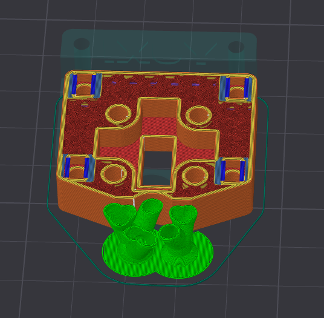
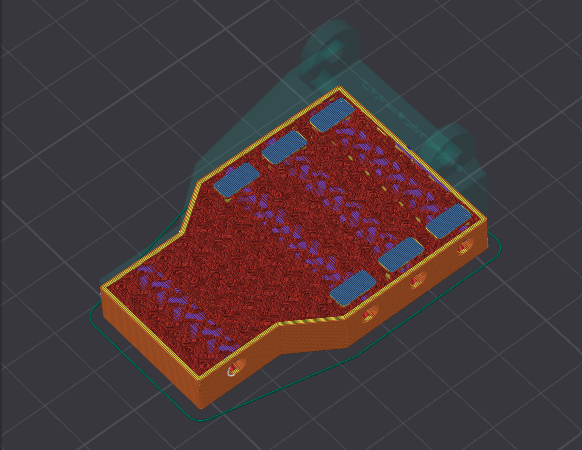
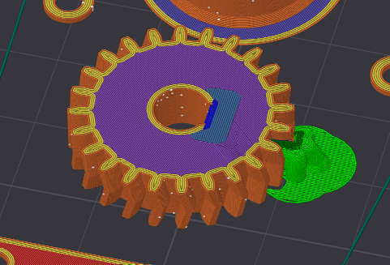
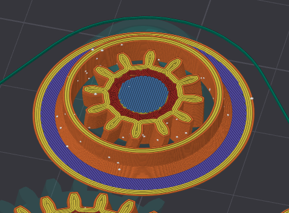
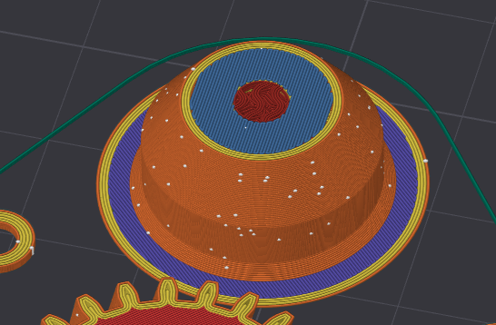

# YUXI ODOMETRY HARDWARE DOCUMENTATION

## External References

* For **software documentation**, see the [YUXI Odometry Software repository](https://github.com/tacterex/yuxi-odometry-software-c).
* For the **FTC SDK library**, see: **TBA**

## Short description

This documentation provides instructions for assembling and using the YUXI ODOMETRY SET.

This document does not cover the electronic assembly of the odometry set. For mechanical assembly instructions, refer to the hardware documentation linked above. Instead, this document focuses on the electronic schematics, firmware, and software capabilities of the system.

Keep in mind that the electronics assembly affects some aspects of the mechanical assembly. Therefore, make sure to read both the hardware and software documentation carefully before starting the assembly.

## Recommended 3D Printer Settings

The 3D-printed parts were designed and tested using the following printer settings:

| Setting            | Recommended value |
| -----------        | ----------------- |
| Printer            | Prusa i3 MK3S     |
| Nozzle size        | 0.2 mm            |
| Material           | PLA / PETG / ABS  |
| Layer height       | 0.1mm             |
| First layer height | 0.15mm            |

> **Note:** The dimensional tolerances were calibrated specifically for the Prusa i3 MK3S. Depending on your printer and its calibration, you may need to adjust the tolerances to achieve the intended fit.

## Bill of Materials

### Hardware

The following hardware is required to fully assemble the project:

| Part                                                                                                  | Quantity |
| ----------------------------------------------------------------------------------------------------- | -------: |
| [M3 locknuts](https://fixpro.ua/kontrgajka-m-3-6-cb-1000shtupak-1)                                    |     ~10* |
| [M3 nuts](https://epicentrk.ua/ua/shop/gayka-shestigrannaya-m3-130-sht-expert-fix.html)               |     ~10* |
| [M3 square nuts](https://fixpro.ua/gajka-kvadratna-nyzka-m-3-din562-1000sht-upak-15)                  |     ~35* |
| [5 × 50 mm springs](https://epicentrk.ua/ua/shop/pruzhina-rastyazhenie-5x50-mm-4-sht.html)            |        4 |
| [6 × 10 × 3 mm pulleys](https://podshipnik.ua/ua/product/pidshipnik-mr106-zz-craft-00042041)          |        6 |
| [M3 × 20 mm countersunk screws](https://fixpro.ua/din965-gvint-m3h20-potgl-cb-ph-1000shtupak-1)       |      ~8* |
| [M3 × 35 mm screws](https://fixpro.ua/din933-bolt-m3h35-a2-pr-2155-335)                               |      ~6* |
| [M3 × 12 mm button-head screws](https://fixpro.ua/iso7380-2-gvynt-m3h12-npkr-gl-10-9-cb-inb-2177-312) |      ~8* |
| AS5600 magnets (supplied with breakout boards, [see software guide](https://github.com/tacterex/yuxi-odometry-software-c#bill-of-materials)) |      2 |

> **Note:** Quantities may change as the project is still under active development. It is recommended to purchase a few spare parts, especially for components with approximate quantities.

### Tools and Supplies

The following tools are required to assemble the project:

* 1.5 mm hex key
* Pliers
* Screwdriver
* 5.5 mm wrench/nutdriver

## Printing Guide

The `stl/` folder contains all the necessary files to print **one odometry pod** and **one Pinpoint Computer**.

To assemble a complete set, you will need:

* **2 × odometry pods**
* **1 × Pinpoint Computer**

The models are ready to be sliced and printed. However, pay close attention to the required **G-code pauses**. Some parts require hardware components to be inserted during the print. The corresponding cavities for these components are visible when slicing the models.

> **Note:** Make sure to insert the required G-code pauses at the appropriate layers before starting the print. Otherwise, you may not be able to install the hardware components correctly.

The `step/` folder contains assembled 3D models of the components. These models can be used as a reference when assembling the odometry pod and Pinpoint Computer.

Lower detailed description of printing settings is provided. Assume that height and layer number is specified for 0.15mm first layer and 0.1mm other layers, which may be different from your printer

### Encoder V2 Lower Part

**Quantity:** 1

**Bed-facing surface:** The lowest face with four square holes.

| Layer height (mm) | Layer | Description                                                 |
| ----------------: | ----: | ----------------------------------------------------------- |
|              9.15 |    91 | Insert four M3 square nuts into the corresponding cavities. |

### Encoder V2 Upper Part

**Quantity:** 1

**Bed-facing surface:** Big flat face with 2 big round holes and 4 small round holes.

### Encoder V2 Body Spacer 1

**Quantity:** 1

**Bed-facing surface:** Flat surface

### Encoder V2 Body Spacer 1

**Quantity:** 2

**Bed-facing surface:** Flat surface

### Pod V2 Body

**Quantity:** 1

**Bed-facing surface:** The biggest flat surface

| Layer height (mm) | Layer | Description                                                 |
| ----------------: | ----: | ----------------------------------------------------------- |
|              7.95 |    79 | Insert six M3 square nuts into the corresponding cavities. |

### Encoder V2 Driving Gear

**Quantity:** 1

**Bed-facing surface:** The biggest flat surface

| Layer height (mm) | Layer | Description                                                 |
| ----------------: | ----: | ----------------------------------------------------------- |
|              5.95 |    59 | Insert one M3 square nut into the corresponding cavity. |

### Encoder V2 Driven Gear

**Quantity:** 1

**Bed-facing surface:** The biggest flat surface

| Layer height (mm) | Layer | Description                                                 |
| ----------------: | ----: | ----------------------------------------------------------- |
|              3.35 |    33 | Insert AS5600 magnet into the corresponding cavity. |
|              9.35 |    93 | Put 6x10mm pulley onto gear shaft |

